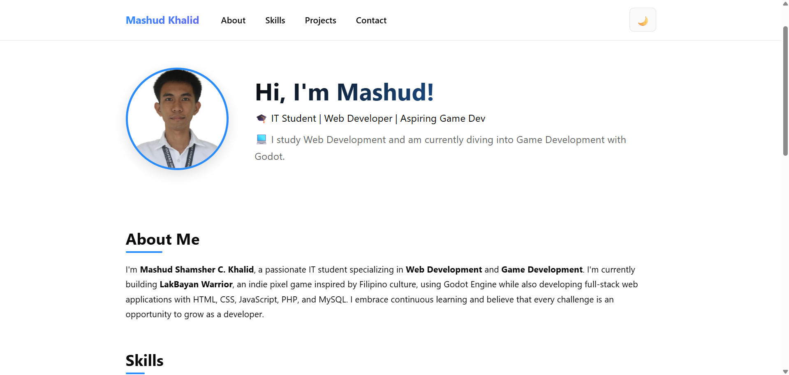

# Portfolio Website



A modern, responsive portfolio website showcasing my projects and skills.

## Technologies Used
- HTML5
- CSS3
- JavaScript

## Setup
1. Clone this repository
   ```bash
   git clone https://github.com/mashudSCK/portfolio.git
   ```
2. Place in your web server directory (e.g., XAMPP htdocs)
3. Access via `http://localhost/portfolio/`

## Features
- Responsive design
- Interactive UI
- Project showcase
- Contact form
- Dark/Light mode toggle

## Skills Highlighted
- Web Development (Full-stack)
- Game Development (Godot Engine)
- Frontend & Backend Technologies
- Database Management

## Contact
Feel free to reach out for collaborations or opportunities!

## License
© 2025 Mashud Khalid. All rights reserved.